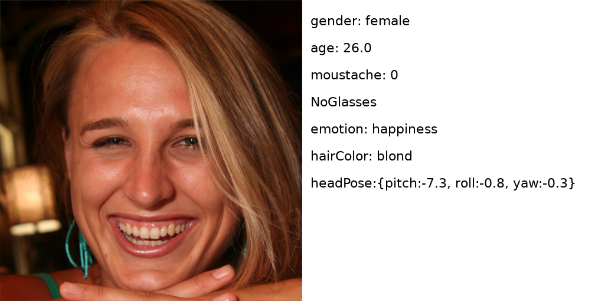

## Gender, Age, and Emotions extracted for Flickr-Faces-HQ Dataset (FFHQ)




This dataset provides various information for each face in the Flickr-Faces-HQ (FFHQ) image dataset of human faces.

The dataset consists of 70,000 json files, each corresponding to a face. For each face, it contains some of the following information:
* head pose
* gender
* age
* moustache, beard, and sideburns probability
* glasses
* emotion: anger/contempt/disgust/fear/happiness/neutral/sadness/surprise
* blur level
* exposure
* noise level
* eye makeup and lip makeup
* accessories
* occlusion
* hair: bald/invisible/hair color probabilities
* smile probability
* face bounding rectangle

## Overview

Information on downloading the images is available on the [FFHQ official page](https://github.com/NVlabs/ffhq-dataset). The extracted features are inside the json folder of this repository.

For example, `00000.json` contains the following information:

```
    {
        "faceId": "866db6af-66ee-4828-b565-994f42571d2f",
        "faceRectangle": {
            "top": 42,
            "left": 32,
            "width": 63,
            "height": 63
        },
        "faceAttributes": {
            "smile": 0.003,
            "headPose": {
                "pitch": 5.4,
                "roll": 1.5,
                "yaw": 15.3
            },
            "gender": "female",
            "age": 0.0,
            "facialHair": {
                "moustache": 0.0,
                "beard": 0.0,
                "sideburns": 0.0
            },
            "glasses": "NoGlasses",
            "emotion": {
                "anger": 0.0,
                "contempt": 0.0,
                "disgust": 0.0,
                "fear": 0.0,
                "happiness": 0.003,
                "neutral": 0.993,
                "sadness": 0.003,
                "surprise": 0.0
            },
            "blur": {
                "blurLevel": "medium",
                "value": 0.55
            },
            "exposure": {
                "exposureLevel": "goodExposure",
                "value": 0.6
            },
            "noise": {
                "noiseLevel": "medium",
                "value": 0.44
            },
            "makeup": {
                "eyeMakeup": false,
                "lipMakeup": false
            },
            "accessories": [],
            "occlusion": {
                "foreheadOccluded": false,
                "eyeOccluded": false,
                "mouthOccluded": false
            },
            "hair": {
                "bald": 0.07,
                "invisible": false,
                "hairColor": [
                    {
                        "color": "brown",
                        "confidence": 0.93
                    },
                    {
                        "color": "blond",
                        "confidence": 0.8
                    },
                    {
                        "color": "black",
                        "confidence": 0.41
                    },
                    {
                        "color": "red",
                        "confidence": 0.28
                    },
                    {
                        "color": "gray",
                        "confidence": 0.22
                    },
                    {
                        "color": "other",
                        "confidence": 0.2
                    }
                ]
            }
        }
    }
```

## Acknowledgements

We thank the authors of the FFHQ dataset. The information was extracted using a neural network. For further information, contact the author.

## Licenses

The individual images were published in Flickr by their respective authors under either [Creative Commons BY 2.0](https://creativecommons.org/licenses/by/2.0/), [Creative Commons BY-NC 2.0](https://creativecommons.org/licenses/by-nc/2.0/), [Public Domain Mark 1.0](https://creativecommons.org/publicdomain/mark/1.0/), [Public Domain CC0 1.0](https://creativecommons.org/publicdomain/zero/1.0/), or [U.S. Government Works](http://www.usa.gov/copyright.shtml) license. All of these licenses allow **free use, redistribution, and adaptation for non-commercial purposes**. However, some of them require giving **appropriate credit** to the original author, as well as **indicating any changes** that were made to the images. The license and original author of each image are indicated in the metadata.

* [https://creativecommons.org/licenses/by/2.0/](https://creativecommons.org/licenses/by/2.0/)
* [https://creativecommons.org/licenses/by-nc/2.0/](https://creativecommons.org/licenses/by-nc/2.0/)
* [https://creativecommons.org/publicdomain/mark/1.0/](https://creativecommons.org/publicdomain/mark/1.0/)
* [https://creativecommons.org/publicdomain/zero/1.0/](https://creativecommons.org/publicdomain/zero/1.0/)
* [http://www.usa.gov/copyright.shtml](http://www.usa.gov/copyright.shtml)

The dataset itself (including JSON metadata, download script, and documentation) is made available under [Creative Commons BY-NC-SA 4.0](https://creativecommons.org/licenses/by-nc-sa/4.0/) license by NVIDIA Corporation. You can **use, redistribute, and adapt it for non-commercial purposes**, as long as you (a) give appropriate credit by **citing our paper**, (b) **indicate any changes** that you've made, and (c) distribute any derivative works **under the same license**.

* [https://creativecommons.org/licenses/by-nc-sa/4.0/](https://creativecommons.org/licenses/by-nc-sa/4.0/)
